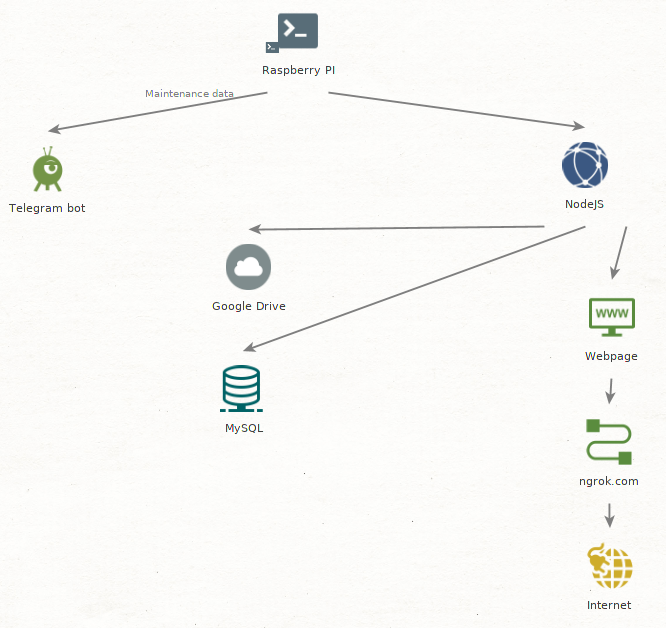

# Link

Current link: https://3acea6ab6ec3.ngrok.io 

Due to main webpage hosting being done through [ngrok](https://ngrok.com/), the webpage link is subject to change.

Link refreshes daily in this repository with the use of git_tunnel.sh script. If the given link is unavailable, try to use it another day, or send me an email at p.pastaryev@gmail.com.

# Approximate server layout:

# Webpage content

As of now, webpage consists of two 'apps'.

1. File manager

	Web file manager allows me to store, retrieve, and modify my files via the web page. All files are stored on the PI for a short period of time, after that they are transferred to Google Drive due to restricted storage space on the PI (see grive_op.js). A MySQL database is used to keep track of the files.

2. Chat app

	The app allows communication between two users. However, the twist is that you can only communicate via PGP-encrypted messages. Messages and keys provided to the app are not stored on the server.

	This app was made as a test to my [Local PGP](https://github.com/x0th/Local-PGP) browser extension.

# Telegram bot

The bot is pretty simple, all it does is allows for easy acces (without the need to login into PI) to results of maintenence scripts. See telegram_bot folder for the main bot code and scripts.